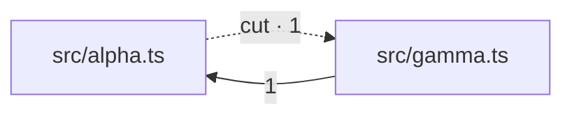

# thicket

A CLI that analyzes a TypeScript codebase and emits a **deterministic plaintext complexity report**, designed to be read by an LLM inside a refactoring loop.

```
thicket report → LLM picks targets → LLM refactors → thicket report → …
```

thicket never judges, never edits, and never opens PRs. There is no score, no grade and no pass or fail. [It is not a linter](#it-is-not-a-linter). It produces **ranked candidates with precise locations** plus a handful of scalar metrics a harness can watch trend across iterations. Deciding what is worth fixing, and when progress is sufficient, is the reader's job.

> **Status: v1, early.** Duplication and module tangle work end to end and are covered by tests; the simplification checks and near-miss duplication described below are not in v1 (see [Known limits](#known-limits)).

## How you use it

thicket finds the candidates. An LLM decides which ones to fix. You can run thicket yourself, or let the agent run it.

### Run it yourself, hand the report over

```bash
thicket > thicket.md
```

With no arguments it analyzes the current directory. It finds the tsconfig files on its own. In a monorepo it covers every workspace. See [Usage](#usage).

Then ask an agent to read the file:

> Read `thicket.md`. It lists duplication and dependency-cycle candidates, and it has not judged them. The top of the file links to a guide. Fetch that first. Pick the findings worth acting on. Tell me what you rejected and why. Then do the top one.

Every report links to [the field guide](https://alecf.github.io/thicket/report-guide.md), as raw Markdown. The agent fetches it and learns what every field means. The guide also says which findings to skip and why.

### Let the agent run it

It is one command that prints text, so the agent can run it too:

> Run `thicket > thicket.md` and read the report. Pick the one finding you are most sure about, and fix it. Then re-run thicket and show me that the finding is gone.

If you do this often, put the command in your `CLAUDE.md` or `AGENTS.md`. Then the agent already knows it:

```markdown
## Finding cleanup work

`thicket > thicket.md` reports duplicated code and dependency cycles. The
findings are candidates, not defects. Plenty of them are not worth fixing. The
report links to a guide that explains every field. Read it before acting.
```

### Close the loop

Run it again afterwards and diff the two reports:

```bash
thicket --json before.json > thicket.md
# ...the agent refactors...
thicket --json after.json > thicket.md
thicket diff before.json after.json
```

```
1 finding resolved, 0 new, duplicated mass -65.2% (253 -> 88), propagation cost 0.44 -> 0.44
  - THK-DUP-c389b5be
```

A finding gets its ID from the code itself, not from where the code sits. So the diff shows you what the agent really fixed. Code that only moved keeps its ID, and an agent that reformatted the copies and called it done shows up as zero resolved.

## It is not a linter

thicket does not score your codebase. Nothing in the report is a defect.

- **No grade and no threshold.** It exits 0 whether it found 3 findings or 18,000. Is that too much duplication? That depends on your deadlines and your team. A tool that answered would be guessing.
- **The summary numbers are trends.** `duplicated mass` counts nested clusters twice, on purpose. Compare one codebase against itself after a refactor. Do not compare two different codebases.
- **Every finding is a candidate**, and often the answer is no. Ask what changes between the copies. If nineteen classes differ only in the *value* of `loincCode` and `unit`, that is one class with two settings, and merging them pays off. If a hundred objects each use *different field names*, they are different things that happen to look alike. Merging those gets you a `pick` helper and nothing else. The report ranks with that in mind, and [the guide says how to check](docs/report-guide.md#is-this-duplication-worth-removing).

That split is the point. thicket does the searching. It reads every file in the program, and finds every repeat above the size threshold, including copies where the names were changed. The agent does the thinking, on the few dozen candidates that come back.

It is also cheaper. A model only sees the files it opens, and opening every file costs tokens for every file. thicket reads them all outside the model, so the search itself costs you no tokens.

## Especially for code an LLM wrote

An agent writes what it can see. It misses the helper in a file it never opened, so it writes that helper again. Every diff looks fine on its own. The copies add up. The next session starts fresh and does it again.

thicket finds exactly that. It matches the same code across files, even when every name is different. That is what `L1` matching is for.

The same code, settings and thicket version always give the same report, so you can run it on a schedule. Run it once a week and compare it to last week:

```bash
thicket --json .thicket/this-week.json > thicket.md
thicket diff .thicket/last-week.json .thicket/this-week.json
```

Then hand `thicket.md` to an agent. Use it for cleanup. Do not turn it into a required check, because that would make it the linter it is not.

## Install

```bash
brew install alecf/tap/thicket
```

You can also download a tarball from [Releases](https://github.com/alecf/thicket/releases). Unpack it and put `thicket` on your `PATH`. A symlink works. macOS and Linux are prebuilt, for arm64 and x64.

The npm name belongs to an unrelated package, so `npx thicket` fetches something else right now. That is [being sorted out](https://github.com/alecf/thicket/issues).

### From a clone

```bash
bun install
bun run thicket --help
```

`bun run thicket` runs `src/cli.ts` directly. There is no build step. You need Bun 1.4 or later. The examples below use that form. With an installed binary, drop the `bun run`.

### What is in the tarball

thicket analyzes your code with `tsgo`, the TypeScript compiler's native binary, and it starts `tsgo` as a child process. So the download is a **folder**, not a single file:

```
thicket            the CLI (~65–83 MB)
tsgo/tsc           the native compiler (~24 MB)
tsgo/lib.*.d.ts    its standard library. tsgo will not start without these
```

Keep them together. `thicket` looks for `tsgo/` next to its own executable, and it follows symlinks to get there. So you can install the folder anywhere and link `thicket` onto your `PATH`. Copying the binary out on its own does not work.

To use a different tsgo build, set `THICKET_TSGO`. Its version is part of the report's config hash. Switching builds therefore invalidates every cached row, and thicket re-analyzes instead of quietly changing the answer.

## Usage

Point it at a directory. With no argument it uses the current one. The report goes to stdout, so it pipes:

```bash
bun run thicket
bun run thicket ./packages/web > report.md
```

thicket finds the tsconfig files itself. It reads `package.json` and `pnpm-workspace.yaml` for declared workspaces, then analyzes each workspace's config. If there are no workspaces, it uses `<dir>/tsconfig.json`. `--no-workspaces` skips the manifests entirely.

`--filter` narrows that selection, the way turbo and pnpm do. Match a package by name or by `./path`. `*` is a wildcard and a leading `!` removes matches. Filters are repeatable, and they apply in order:

```bash
bun run thicket --filter '@acme/*' --filter '!@acme/legacy-ui'
```

`--config` names the tsconfig files yourself, and turns discovery off. Repeat it for each one. Passing the same path twice does nothing, because the TypeScript API drops duplicates. Passing different configs analyzes them together as one body of code, so thicket finds a package that was duplicated across two of them:

```bash
bun run thicket --config packages/a/tsconfig.json --config packages/b/tsconfig.json
```

For the loop, keep the JSON sidecar and diff it against the next one. [Close the loop](#close-the-loop) above shows the short form:

```bash
bun run thicket --config ./tsconfig.json --json before.json > /dev/null
# ...an LLM refactors something...
bun run thicket --config ./tsconfig.json --json after.json  > /dev/null
bun run thicket diff before.json after.json
```

`diff` exits 0 because the comparison ran, not because the numbers got better. Whether a change is good enough is your call. A tool that answered it in an exit code would be judging.

### Flags

| Flag | Meaning |
|---|---|
| `[dir]` | Directory to analyze, default `.`. Its workspaces are discovered from `package.json` / `pnpm-workspace.yaml`. |
| `--filter <pattern>` | Analyze only these workspaces. Match by package name or `./path`. `*` is a wildcard and a leading `!` removes matches. **Repeatable**, applied in order. |
| `--no-workspaces` | Ignore workspace manifests and analyze `<dir>/tsconfig.json` alone. |
| `--config <path>` | tsconfig to analyze, instead of finding them. **Repeatable.** A solution-style config that owns no files and only lists `references` is expanded. |
| `--depth <1..5>` | How deep to look. Sets the smallest fragment size and the findings cap per section. Default `3`. |
| `--min-nodes <n>` | Set the smallest fragment size in AST nodes, overriding `--depth`. Smaller means more and finer candidates. |
| `--min-lines <n>` | Set the smallest fragment size in lines, overriding `--depth`. The node count does not control this, because 15 AST nodes can fit on one line. Extracting a one-line shape always costs more than it saves. |
| `--budget-tokens <n>` | Hard ceiling on the whole report. Findings drop off the bottom of the ranking, and the report always prints how many it dropped. |
| `--max-locations <n>` | Cap the files each finding names. By default there is no cap, so an agent can reach every copy. |
| `--granularity <g>` | How files are grouped into modules for the graph: `auto` (default), `file`, or a directory depth like `2`. |
| `--include-generated` | Also analyze `dist/`, `build/`, `.next/` and the like, which are skipped by default. Matching is on whole path segments, so `src/distance/` counts as source either way. This also stops thicket honouring a file's own `@generated` banner. |
| `--no-banner-scan` | Stop reading an `@generated` or "auto-generated" banner as a sign the file is generated. The skipped directories stay skipped. Each opinion has its own off switch. |
| `--include-call-sites` | Also report clusters that are only repeated calls to shared code. thicket leaves these out by default: when the whole fragment is one call, nothing shorter can replace it, so the extraction removes no line. |
| `--no-file-conventions` | Stop ranking down a shape that is declared once per file across files of one role, such as one `meta` per `*.stories.tsx`. thicket reads those as a framework's API rather than as duplication, because deleting a copy deletes a story. |
| `--exclude <glob>` | Skip files matching this glob. **Repeatable.** This is your instruction, not a guess, so `--include-generated` does not cancel it. |
| `--types <mode>` | Whether to analyze type declarations and type-only imports: `include` (default), `exclude`, or `only`. |
| `--json <path>` | Also write the JSON sidecar here. The Markdown still goes to stdout. |
| `--no-cache` | Re-analyze every file, ignoring `.thicket/cache.db`. |
| `--help` | Print usage. |

The depth presets, in full:

| `--depth` | `--min-nodes` | `--min-lines` | findings per section |
|---|---|---|---|
| 1 | 40 | 10 | 10 |
| 2 | 25 | 6 | 20 |
| 3 (default) | 15 | 4 | 40 |
| 4 | 10 | 3 | 80 |
| 5 | 6 | 2 | 200 |

`--depth` is the knob a person turns. `--budget-tokens` is the knob a harness turns, because a harness knows its context window but not how deep you want to look.

### Commands

| Command | Meaning |
|---|---|
| `diff <before.json> <after.json>` | Compare two `--json` sidecars. Shows findings resolved, findings added, and how each metric moved. It analyzes nothing, so it needs no tsconfig. |
| `cache clear` | Delete `.thicket/cache.db` for the project. Takes the same `--config` flags, because the cache lives with the codebase and not with your working directory. |

## Report format

Pointed at this repository's own test fixture, `bun run thicket --config tests/fixtures/sample/tsconfig.json` prints exactly this:

`````markdown
# thicket report

thicket 0.1.0 · config bfa30832 · 4 files / 56 LOC · granularity: file (4 modules)

**How to read this report:** https://alecf.github.io/thicket/report-guide.md

## Summary

| metric | value |
| --- | --- |
| analyzed | 4 of 4 source files (100.0%) |
| duplicated mass | 253 redundant nodes (overlapping; trend only) |
| duplicated coverage | 37.9% of source bytes |
| propagation cost | 0.44 |
| dependency cycles | 1 (largest SCC: 2 modules) |
| findings | 3 of 3 shown |

## Duplication

`L0` matches copies that are identical once formatting is normalized; `L1` also ignores what identifiers are called. Each finding is therefore the copies of one exact shape — a near-variant that differs by an inserted line is a separate finding, cross-referenced as **see also** where one exists.

### THK-DUP-d165768d · 3 copies × ~10 lines · ~16 lines recoverable

L1 · `FunctionDeclaration`

- **directly imported by:** 1 file outside the cluster

```ts
export function normalizeAlpha(points: Point[]): Point[] {
  const result: Point[] = [];
  for (const p of points) {
    const dx = p.x - ORIGIN.x;
    const dy = p.y - ORIGIN.y;
    const len = Math.sqrt(dx * dx + dy * dy);
…
```

- `src/alpha.ts:4`
- `src/beta.ts:3,14`

### THK-DUP-c389b5be · 2 copies × ~10 lines · ~7 lines recoverable

L0 · `Block`

- **directly imported by:** 1 file outside the cluster

```ts
{
  const result: Point[] = [];
  for (const p of points) {
    const dx = p.x - ORIGIN.x;
    const dy = p.y - ORIGIN.y;
    const len = Math.sqrt(dx * dx + dy * dy);
…
```

- `src/alpha.ts:4`
- `src/beta.ts:14`

## Module tangle

Arrows run importer → imported. The number is import sites — one per symbol per importing file, `export … from` re-exports included; `type` marks an edge erased at compile time and so not a runtime dependency at all. The dotted arrow is the suggested cut.

### THK-CYC-aca08f5a · SCC of 2 modules



- **file cycles:** 1 crosses these modules (largest 2 files: `src/alpha.ts` ↔ `src/gamma.ts`).
- **suggested cut:** `src/alpha.ts` → `src/gamma.ts` — 1 symbol in `src/alpha.ts`
- **leaves:** nothing — this breaks the cycle completely.

`````

That fixture holds three `normalize` functions with the same structure, two of them byte-identical, plus an `alpha ↔ gamma` import cycle. Both duplication findings are real, and they are not the same finding. The **L1** one covers all three functions, which match once the identifiers are α-renamed. The **L0** one covers only the two that match byte for byte. It is reported as a `Block` rather than a `FunctionDeclaration` because those two functions have different *names*, so the largest node that matches exactly is the body.

Findings run in this order: `## Duplication`, then `## Module tangle`, then `## Duplication in tests`. A token budget cuts from the bottom, so a tight budget costs you test hygiene before it costs production work.

### Reading a finding

The heading gives you the id to cite and the size to judge by. The line under it gives you `L0` or `L1`, the AST kind, the rank score, and a `[test]` or `[mixed]` tag when one applies. Only the order of the score means anything; the units do not.

`~10 lines` is the median size of one copy. `~16 lines recoverable` is what a successful extraction deletes: `(copies − 1) × (lines − 1)`, minus the signature the extracted version costs.

Locations list one entry per file, so `src/beta.ts:3,14` means two copies in one file. **Every** location is listed. They used to stop at six files and print `… and 13 more files`, which told an agent there was work left and gave it no way to reach the work. It grepped for the shape by hand instead. `--max-locations <n>` brings the cap back if you would rather truncate a finding than lose it to a token budget.

The fenced block under each finding is the head of its first copy. An AST kind on its own, like `PropertyAssignment` or `Block`, tells you nothing about whether the finding is worth acting on. Without the excerpt you have to open files, and one cluster can span a hundred of them.

### The report is valid CommonMark

This is a tested property, not an aspiration. `tests/markdown-validity.test.ts` checks the rendered report, the golden file, a scope-warning report, and a truncated one. It looks for indented prose, headings with no blank line before them, unbalanced fences, and tables missing their delimiter row.

It matters because the older plaintext-ish format was not valid Markdown, and you only saw it once something rendered the file. Every body line was indented two spaces. CommonMark folds that into the paragraph above. The whole Summary collapsed onto one line, and the location list swallowed the four-space excerpt instead of letting it become a code block. An indented code block cannot interrupt a paragraph. Only a fenced one can.

Excerpt fences carry the language of the file they came from. They are also longer than any run of backticks inside them. So a fragment holding a template literal or a Markdown snippet cannot close its own block and spill the rest of the report onto the page as prose.

### What each finding says about its surroundings

Two lines above the excerpt describe the code around the copies.

- **`every copy imports:`** files that every copy in the cluster imports. Files the rest of the codebase imports just as often are left out. This is where the copies' shared vocabulary already lives, and often where the abstraction already lives too. On a real report, the top finding was 19 duplicated classes, and this line named the base class that already had the generic factory methods all 19 reimplement. That is the difference between designing an abstraction and deleting the overrides.

  thicket **follows a re-export shim through** to the real file: `models/vitals/VitalObservation.ts → packages/models/src/wearables/VitalObservation.ts`. Naming only the first file is how that same finding failed on the next run. The file it named is nine lines of `export * from`, and the 1012-line base class the whole refactor turns on was one hop further on. The agent had to find it by hand. thicket follows a file only when it forwards exactly one module and imports nothing of its own. A thirty-module barrel does not stand for any single thing, so it is named as itself.
- **`directly imported by:`** how many files outside the cluster reach into it. This turns "this looks big" into "this is contained", and it usually decides whether the work gets scheduled. A re-export barrel hides its own consumers, so thicket counts what the barrel hides and names it: `5 files outside the cluster, and 17 files more through models/vitals/index.ts`. The bare 5 was a floor printed as a total. An agent checked it, found 22, and reported the number as a bug.

  The line is **left out for a cluster of test files**. Nothing imports a test file, so `nothing outside the cluster` is true of every such finding and tells you nothing about any of them.

### Whether merging would buy anything

Copy count tells you how much is duplicated. It does not tell you whether merging leaves the code better. Two clusters can look the same to the ranker and have opposite answers:

- 19 observation classes that differ only in the strings `loincCode`, `unit` and `junctionKey`. Same fields, different values. That is one concept with a parameter list, and a base class absorbs it. Worth about 2200 lines.
- 193 three-field projections covering 89 different key sets, 62 of which appear exactly once. `{ labOrderId: p.labOrderId, … }` next to `{ average: s.average, … }`. Different fields, so these are different objects that happen to share a syntax template. The only abstraction available is a generic `pick`, and no future change benefits from it.

Both are L1 clusters with almost no exactly-identical members. The second ranked **second in the report**, and two agents asked to act on it turned it down. So thicket asks whether the *field names* drift. Same names with different values is one shape with parameters. Different names is several shapes wearing one template. Renamed locals do not count, because that is what an L1 match already means, and it extracts fine.

The penalty scales with the share of field names that drift. It runs on a pool three times the size of the section, before the top findings are sliced off. It needs token streams, and the ranker cannot afford those across eighteen thousand candidates.

### What varies between the copies

- **`varies across copies:`** `loincCode` (18), `loincDisplay` (19), `unit` (13), `unitCode` (13)

Report the sameness without the variation and a real finding reads as "19 similar classes". It was really 19 rows of a config table that someone compiled into classes, and that second phrasing hands you the abstraction: a base class with four static fields. One agent spent most of its investigation rebuilding this list by hand.

Only **literal values** are named. An identifier that differs is what an L1 match already means, and listing every renamed local buries the constants that matter under a dozen entries for `x`, `y` and `sqrt`.

The number is how many distinct values that field takes, and it is worth reading. The line above comes from a 19-copy cluster with 18 distinct LOINC codes, because two of the classes declare the same one. That is a live query-correctness bug, and it has nothing to do with duplication. The agent that found it had to extract the constants itself to see it.

### Where the fix might already exist

- **`same shape in other surroundings:`** `apps/web/vitest.setup.tsx:36`, … and 19 more files

This is the report's cheapest pointer at code that may already *be* the extraction, and it costs nothing to compute. It is what subsumption used to throw away. When a smaller cluster collapses into a larger one, the copies of the smaller that do not sit inside the larger are the same fragment nested somewhere else. That is where a deduplicated version tends to live.

On a real application, 115 copies of a `matchMedia` stub read as "extract a helper into 115 files". The identical block already sat in the project's Vitest setup file behind one extra guard, which made all 115 dead code. The work was to delete them. An agent that got the finding without this line planned the wrong refactor.

Locations are sorted **shallowest path first**, because a shared thing lives higher in the tree than its copies do. Alphabetical order buried that setup file under twenty test files six directories deeper.

### Near-variants of the same shape

- **`see also THK-DUP-…:`** `81% the same shape, 5 more copies`

An L1 match is exact once identifiers are renamed. So a template, and a copy of it with one field inserted, become two findings with nothing linking them. On a real report that was 19 duplicated classes, plus 5 more that sat two lines from the same template. Act on the report alone and you leave the five behind and pay for a second visit.

Similarity is shingle Jaccard over the L1 token stream, computed only among the findings actually printed. The threshold was measured, not guessed. Across 758 non-overlapping pairs, the real template-and-variant pair scored **0.813**, the next pair scored **0.462**, and everything else came in below 0.31. The bar sits in the empty band between.

The pairs it must *not* link are fragments and their own ancestors, which PRD §5.4 flags. The same measurement confirmed it: the two most similar pairs scored 1.000 and 0.921, and both were a node next to the node containing it. Overlapping occurrences are excluded outright.

All three of these lines came from handing a report to agents that had never seen this tool, and asking whether the top finding was actionable. Three of them named the same gap independently. The report said "here are 19 identical things" and said nothing about the code around them, and the surrounding code decided feasibility every time.

### The numbers in the heading

Size is why both numbers are there. Three duplicated lines are not worth a refactor and thirty are, and you cannot tell which you are looking at from an AST node count. 17 nodes is four lines in one finding and eleven in the next.

`findings 3 of 3 shown` matters. Truncation is never silent, and "38" and "38 of 495" mean very different things to a harness deciding whether it is done.

When findings are held back, an **Omitted** section says what is in them: a count per category, and a histogram of the duplication candidates by recoverable lines. A bare count does not survive a real repository. One run reported `18768 further findings omitted`. That reads equally well as a codebase full of cycles, as one tangle restated thousands of times, or as thresholds that admit mostly noise. The breakdown settled it in two lines. Exactly **2** of the 18,808 were cycles, and **62%** of the duplication recovers fewer than ten lines. The histogram covers every candidate, not just the withheld ones, because the question is what kind of pile the printed findings came off.

### Two duplication sections

Duplication whose copies are mostly test files goes in its own **`## Duplication in tests`** section. It sits below the production findings and below the module tangle, and it gets a much smaller cap.

This is a split rather than a weight because no weight worked. On a real application, test scaffolding took **10 of the top 40** slots: 231 copies of `{ info: vi.fn(), warn: vi.fn() }`, and 124 copies of `afterEach(() => vi.restoreAllMocks())`. The ranker was right that they were large. `recoverableLines` is `(copies − 1) × (linesPerCopy − 1)`, so a 6-line shape repeated 231 times really does beat a 30-line clone repeated twice.

Sweeping the test down-weight from 0.4 to 0 moved that count from 10 to 0 smoothly, with no natural break anywhere on the curve. Every threshold was an arbitrary point on a smooth tradeoff, and the ones low enough to clear the top 40 also buried real duplication between tests.

Separate sections make the question go away. The two kinds of work no longer compete for a slot, so neither has to be scored against the other. On that application, the production section's new lead finding was a **124-line class duplicated 19 times, worth 2,212 recoverable lines**, which mock setup had been sitting on top of.

A tie counts as test: a cluster with half its copies in test files is as much scaffolding as it is production duplication. The split uses the measured share, never the `[mixed]` tag, because a cluster that is 95% test files is tagged `mixed` and is still scaffolding.

Raising `--min-lines` is not a substitute. Going from 4 to 10 on that repository dropped 29 of the top 40 findings and 32% of the recoverable lines. It deleted 67 copies of a column-selection object and 39 copies of a shared static method along with the noise. The test scaffolding in the top 40 went from 10 findings to 9.

That whole report is pinned byte for byte in `tests/golden/sample-report.md`. CI also renders it on Linux and on macOS, under a locale whose sort order disagrees with code-unit order, and fails if the two machines differ by a single byte.

## What the metrics mean

### `analyzed`

How many of the TypeScript files on disk under the project root made it into the program, and so into everything else in the report. A `tsconfig.json` decides that, and it can decide it very differently from what you expect.

One real monorepo's root config excluded `apps` and `packages`. The default run built its program from **176 of 6,286 files**, then reported zero dependency cycles and a propagation cost of 0.05. Both numbers were artifacts of the missing 97%.

When the program misses part of the tree, thicket says so above the findings, and names the `--config` that closes each gap:

```
⚠ 6110 source files are outside this program. Every number above is drawn from the 2.8% that is inside it.
    apps/web  5262 files  → --config apps/web/tsconfig.json
    apps/mobile  451 files  → --config apps/mobile/tsconfig.json
```

The denominator counts hand-written TypeScript only. No `.d.ts` files, no generated directories, and nothing under a dot-directory. An agent worktree in `.claude/` is a second copy of the whole repository, and it would halve every coverage figure in the report.

### `duplicated mass`

Σ *nodes × (copies − 1)* over the reported clusters. Roughly: how many AST nodes a perfect deduplication would delete.

Clusters **overlap and nest**. A `Block` sits inside the `FunctionDeclaration` that contains it, and thicket reports both, so the same source gets charged more than once. This is **not a fraction of anything**, and you cannot compare it between two codebases. It is a trend number. Watch it fall across the iterations of one loop.

### `duplicated coverage`

The share of source bytes covered by at least one *redundant* copy.

In each cluster, the first copy in sorted order is the original a refactor would keep. The rest are redundant. thicket takes the union of their byte ranges across every cluster, so overlapping and nested findings count their shared bytes once. This is a real fraction between 0 and 1, and it is the number that answers "how much of this codebase repeats itself".

### `propagation cost`

How dense the module graph is once you follow every path. Of all *n²* ordered pairs of modules, the share where the first one depends on the second, directly or through anything else.

This is the "change one thing, how much can it affect" number. A module inside a cycle reaches itself, which is why cycles push it up.

### `dependency cycles` and `largest SCC`

Strongly connected components of the module graph with more than one member, found with Tarjan's algorithm.

Each one comes with a **suggested cut**. Not "there is a cycle here", but "remove this edge and the cycle breaks". thicket verifies that by running Tarjan again on the graph without that edge. When no single edge is enough, the report says so instead of guessing.

**Dissolve before you cut.** First thicket looks for edges that are routing rather than dependency. An import that resolves through a re-export depends on the *origin*, not on the file it names. So if nearly everything crossing an edge is forwarded from outside the module being depended on, you can **dissolve** the edge: point the import at the origin and the edge disappears. Nothing else changes, because a re-export is the same binding.

That is a different job from a cut, and a much cheaper one. A cut is a design decision, so you invert a dependency, move code, or agree a layering. A dissolve is a find-and-replace. thicket lists dissolves first, and only suggests a cut for whatever survives them.

On a real 12-module tangle this found five edges: `lib → app` (72 of 81 imports), `actions → app` (all 45), `data → app`, `models → app`, and one more. Every one of them passed through a single file that re-exports `lib/errors.ts`. An agent that had investigated that tangle by hand called those five lines "the entire actionable content of this finding".

**This is not a rule about barrel files.** A package's own entry point looks identical: 100% forwarded. Dissolving it would reach past a boundary that exists on purpose. What separates the two cases is whether the forwarded code lives in *another module*. That is a fact about the dependency, not an opinion about file layout. The `passthrough` fixture pins both cases, and a test fails if you remove either condition.

**No cut for a tangle with no file cycle under it.** A module SCC is a claim about directories. If no file in those modules imports its way back to itself across a boundary, then cutting an edge removes no cycle, because there is no cycle. A real 7-module tangle was exactly this, and the cut thicket used to propose removed nothing.

**A type-only edge is demoted, not banned.** Those edges are erased at compile time, so cutting one changes nothing that runs, and a runtime edge wins any tie. thicket once *preferred* them, on the grounds that moving a types file is the cheapest fix. On a real 12-module tangle that produced exactly the wrong recommendation: a two-symbol `types → models` cut that an agent did in ten minutes and correctly reported as a no-op. Banning them outright over-corrected. What made that cut worthless was that it shaved one module off the tangle and left the rest, and the rule below catches that on its own. A cycle in the type system is still real complexity, because a reader cannot understand either module without the other. So a type-only cut that breaks a cycle completely is proposed, and the report labels it `type-only`.

**The cut is chosen by how much of the tangle it dissolves**, not by what it costs. Picking the cheapest edge that works reliably finds the least interesting cut. On a real 7-module tangle it proposed a one-symbol edge that detached a leaf and left the other six knotted together. Cost only breaks ties between cuts that dissolve the same amount. Among those, thicket prefers a runtime edge over a type-only one, then the fewest files to edit, then the fewest symbols.

**A cut has to remove enough to be worth doing.** It must leave at most two thirds of the tangle standing, or remove the cycle outright. Otherwise thicket suggests nothing and says what it rejected: "the best available leaves 8 of 9" and "nothing helps" are different answers, and an agent given only the second recomputed the first by hand before it would believe the tangle was irreducible.

**Every tangle says whether any file is really circular.** A module SCC is a claim about directories, and the directories are a choice this tool made. On a real 7-module tangle across 417 files there were three file cycles. All three sat inside a single directory, and none crossed a boundary the finding drew. So nothing circular executes, there is no module-init hazard, and the fix removes no real cycle. An agent had to write its own Tarjan implementation to work that out, and it reversed its recommendation. The same line on a 12-module tangle in the same repository reads `6 cross these modules (largest 77 files, including …)`, which is the opposite verdict. That is why the line earns its space. It is the same algorithm one granularity down, on a graph thicket has already built.

**Every cut says what it leaves behind**: `leaves: 6 of 7 modules still mutually dependent`, or `nothing — this breaks the cycle completely`. Without that line, "suggested cuts (1)" reads as "apply this and the tangle is gone", and for a cut that only detaches a leaf, that is false.

### How a tangle is drawn

Each tangle is a **mermaid flowchart** of the whole component. Every edge inside the SCC is drawn, labelled with the number of import sites crossing it, and the suggested cut is a dotted arrow.

A legend above the section says what that number counts: import sites, one per symbol per importing file, re-exports included. It is neither distinct symbols nor files. An agent that assumed it was distinct symbols mismatched every edge of a 26-edge tangle and concluded the tool was broken.

If every module in the component shares a path prefix, that prefix moves **into the heading**: `SCC of 7 modules under apps/mobile/`. Then the chart reads `components -->|148 (34 type)| lib`, instead of repeating `apps/mobile/` fourteen times across seven nodes. Whole path segments only, and only when the prefix is at least two deep. `src/` is the source root and tells you where you are. `apps/mobile/` is the one part of every name that distinguishes nothing.

Edges made **entirely of `import type`** are marked `type`. Such an edge is erased at compile time. There is no module-init order to get wrong and no bundler cycle, and breaking it usually means moving a types file rather than inverting a dependency. On a real 12-module tangle, the most interesting edge was 100% type-only while the suggested cut was a value import. Print the two the same way and you send the reader after the wrong one.

One value import anywhere across the module pair clears the flag. A side-effect import like `import "./x.js"` binds no names, and it is emphatically not erasable, so thicket vetoes the flag rather than deriving it from the counts. An import that binds zero names erases zero, and `erased === weight` would call it type-only.

An edge that is only **mostly** erased says so. `5 (4 type)` means four of its five bindings are `import type`, so the entire runtime dependency is one import in one file. That is usually the cheapest cut available. A real 7-module tangle printed that edge as a bare `5`, and nothing about it suggested a second look. Edge weights are what make the picture usable: a 12-module tangle in a real application turned out to be held together by a handful of 1–3 symbol edges, among links carrying two thousand.

Every edge label is **quoted**. An unquoted mermaid label ends at the first `(`, `[`, `{` or `|`, which is how the `59 (4 type)` form shipped a chart that would not render.

The chart is drawn in full or not at all. Drop arrows from a cycle and what is left can look acyclic, so a partial chart is not a weaker claim. It is a wrong one. Past 20 modules or 120 edges, thicket prints the member list and a line saying why.

### Locations, excerpts, and IDs

A finding that names more than a dozen files gets a **summary above its location list**, not instead of it: `spread across 1 directory: apps/web/models/member/vitals ×19`, or `spread across 66 directories: … and 63 more directories`.

One agent handed a 115-file list wanted nine tenths of it replaced by exactly that summary. Whether the finding was one directory's convention or a problem across packages was the thing it could not see, and it counted by hand. Another agent, holding a 19-file list, called every entry "the finding's backbone" and used all of them. Both were right about their own finding, so the list stays and gets a header.

The **excerpt scales with the size of one copy**: 60% of its lines, never fewer than three and never more than ten. A flat three lines failed on the findings that needed it most. On a real 15-line block, the hidden lines 4 to 13 were the only thing separating that cluster from five near-identical siblings. The excerpt showed the reader the agreement and hid the disagreement. Three lines of a 100-line class is still the right amount, which is why this is a fraction rather than a bigger constant.

**Finding IDs** (`THK-DUP-…`, `THK-CYC-…`) come from **content, never position**. Code that only moves keeps its ID, whether it was reformatted, pushed down by a new import, or reordered inside its file. So `thicket diff` reports what was actually resolved, not what was merely touched. This is the backbone of the loop, and an end-to-end test moves real code and checks that the IDs survive.

## What it looks for

**Duplication.** Every AST node above a size threshold becomes a fragment, so the granularities nest on their own. A function is a fragment, the loop inside it is a fragment, and the conditional inside that is a fragment. thicket fingerprints each fragment at two levels: **L0** matches exactly, and **L1** α-renames identifiers so that renamed variables still match. Fragments with identical hashes are clustered with union-find.

**Module tangle.** thicket resolves imports through the type checker, groups files into modules at a granularity it picks for the repo, then looks for cycles and propagation cost in the resulting graph.

The interesting result is the **join** between the two. *Modules A, B and C form a cycle and share 4 duplicated clusters. Extract the shared logic into a leaf module and the cycle dissolves on its own.* Neither analysis finds that alone.

## The design constraint that shapes everything

A 48-file repository produces about **495 duplication candidates**. A report budget realistically holds 20 to 50 findings.

So thicket throws away candidates by two orders of magnitude. Another detection technique would only add to a pile that is already being truncated:

> **Rank well, then detect more. Never the other way round.**

That one conclusion cut embeddings from v1, removed every native dependency, and makes the ranking function the most important code in the project.

## What thicket deliberately does not do

- **It does not judge.** No thresholds, no grades, no pass or fail, no exit code that means "too complex". It reports candidates and metrics. Something else decides what is worth fixing. See [It is not a linter](#it-is-not-a-linter).
- **It does not edit.** No codemods, no autofix, no `--write`.
- **It does not open PRs**, post review comments, or touch your version control in any way.
- **It does not report progress for you.** `diff` prints what changed between two reports. Whether that is enough progress to stop is your call.

## Known limits

- **Near-miss duplication is not in v1.** thicket finds exact (L0) and α-renamed (L1) matches only. Two functions that differ by one added statement are two separate fragments to it. The MinHash and LSH work for near-miss detection sits in `prototypes/`, unused, because the binding constraint is ranking and not recall.
- **The simplification checks are not in v1.** Those are parameters that take the same constant at every call site, conditions that are always true, and exports nobody imports. The type checker knows all three, and nothing reads that yet. A v1 report has no `THK-INV-…` findings.
- **The ranker cannot tell a data table from a code block.** An object literal repeated 15 times and a function body repeated 15 times look the same to it: same node count, same copy count, same score. thicket down-weights repetition inside one file and caps the copies counted per file, which keeps a config literal off the top of the report. A few data tables still reach the lower half. Do not treat those as refactoring candidates. thicket cannot yet make that call for you.
- **Duplication is reported at every size that matches.** A cluster and a smaller cluster with the *same* number of copies collapse into the larger one. An L0 pair nested inside an L1 triple stays as two findings, as in the example report above. They are genuinely different facts, and they still cost two report slots.
- **You still need a real tsconfig. thicket just finds it for you.** Import resolution runs through the type checker, so it cannot analyze a directory with no tsconfig anywhere in it. Pointing at a directory finds the configs; it does not do without them. Declaration files (`.d.ts`) and `node_modules` are never analyzed.

## Design notes

- [`docs/PRD.md`](docs/PRD.md) is the technical PRD, and the reasoning behind nearly every decision above. Each one is backed by measurement against real codebases, and several of those measurements overturned the starting premise. Go was the original implementation language, and embeddings were the original duplication mechanism.
- [`AGENTS.md`](AGENTS.md) holds the non-negotiables for anyone changing this code, human or otherwise. Determinism is a correctness property here, not a nicety.
- [`prototypes/`](prototypes/) holds the throwaway scripts that produced those measurements. They are kept because each one implements an algorithm the real code needs.

## Stack

TypeScript on Bun 1.4 or later, with **nothing to compile at install time**. The cache uses `node:sqlite`, and the frontend uses `typescript@next`. TypeScript 7.1 ships a real programmatic API, `typescript/unstable/async`, backed by the Go compiler. That is the only way to get real type information instead of approximate syntax.

That compiler is a native binary, and thicket starts it as a child process. It is why a release is a folder rather than a single file. Each platform's build ships in the tarball, so you do not need a toolchain for it.

## License

MIT
