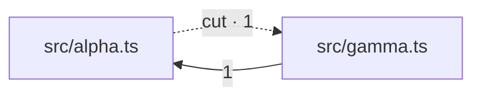

# thicket

A CLI that analyzes a TypeScript codebase and emits a **deterministic plaintext complexity report**, designed to be read by an LLM inside a refactoring loop.

```
thicket report → LLM picks targets → LLM refactors → thicket report → …
```

thicket never judges, never edits, never opens PRs. It produces **ranked candidates with precise locations** plus a handful of scalar metrics a harness can watch trend across iterations. Deciding when progress is sufficient is the harness's job.

> **Status: v1, early.** Duplication and module tangle work end to end and are covered by tests; the simplification checks and near-miss duplication described below are not in v1 (see [Known limits](#known-limits)).

## Install

Not on npm — the name is taken by an unrelated package, so `npx thicket` will fetch something else. Run it from a clone:

```bash
git clone <this repo> && cd thicket
npm install
npm run build
node dist/cli.js --help
```

Node ≥24 is required: the cache uses the built-in `node:sqlite`. `npm link` puts a `thicket` on your `PATH` if you want one; the examples below spell out `node dist/cli.js`.

## Usage

Point it at a tsconfig. The report goes to stdout, so it pipes:

```bash
node dist/cli.js --config ./tsconfig.json
node dist/cli.js --config ./tsconfig.json > report.md
```

A monorepo takes one `--config` per project. Passing the same path twice does nothing useful — the TypeScript API dedupes by path — but genuinely distinct configs are analyzed as one corpus, so a package duplicated across two of them is found:

```bash
node dist/cli.js --config packages/a/tsconfig.json --config packages/b/tsconfig.json
```

For the loop, keep the JSON sidecar and diff it against the next iteration's:

```bash
node dist/cli.js --config ./tsconfig.json --json before.json > /dev/null
# ...an LLM refactors something...
node dist/cli.js --config ./tsconfig.json --json after.json  > /dev/null
node dist/cli.js diff before.json after.json
```

```
1 finding resolved, 0 new, duplicated mass -65.2% (253 -> 88), propagation cost 0.44 -> 0.44
  - THK-DUP-c389b5be
```

`diff` exits 0 because the comparison ran, not because the numbers improved. Whether a delta is good enough is a policy question, and a tool that encoded one in its exit code would be judging.

### Flags

| Flag | Meaning |
|---|---|
| `--config <path>` | tsconfig to analyze. **Repeatable.** Defaults to `./tsconfig.json`. A solution-style config that owns no files and only lists `references` is expanded. |
| `--depth <1..5>` | Preset for how deep to look: sets the minimum fragment size and the findings cap per section. Default `3`. |
| `--min-nodes <n>` | Override the depth preset's minimum fragment size, in AST nodes. Smaller means more, finer candidates. |
| `--min-lines <n>` | Override the depth preset's minimum fragment size, in lines. A node count does not bound this — 15 AST nodes fit on one line — and extracting a one-line shape is a strict loss. |
| `--budget-tokens <n>` | Hard ceiling on the whole report. Findings are dropped from the bottom of the ranking and the count dropped is always printed. |
| `--max-locations <n>` | Cap the files each finding names. Unset — the default — names every one, so an agent can reach every copy. |
| `--granularity <g>` | How files are grouped into modules for the graph: `auto` (default), `file`, or a directory depth like `2`. |
| `--include-generated` | Also analyze `dist/`, `build/`, `.next/` and friends, which are excluded by default. Matching is by whole path segment, so `src/distance/` is source either way. |
| `--json <path>` | Additionally write the JSON sidecar here. The Markdown still goes to stdout. |
| `--no-cache` | Re-analyze every file, ignoring `.thicket/cache.db`. |
| `--help` | Print usage. |

The depth presets, in full:

| `--depth` | `--min-nodes` | `--min-lines` | findings per section |
|---|---|---|---|
| 1 | 40 | 10 | 10 |
| 2 | 25 | 6 | 20 |
| 3 (default) | 15 | 4 | 40 |
| 4 | 10 | 3 | 80 |
| 5 | 6 | 2 | 200 |

`--depth` is the knob a human turns; `--budget-tokens` is the knob a harness turns, because a harness knows its context window and not its desired depth.

### Commands

| Command | Meaning |
|---|---|
| `diff <before.json> <after.json>` | Compare two `--json` sidecars: findings resolved, findings added, and how each metric moved. Analyzes nothing, so it needs no tsconfig. |
| `cache clear` | Delete `.thicket/cache.db` for the analyzed project. Takes the same `--config` flags, because the cache lives with the codebase rather than with the working directory. |

## Report format

Pointed at this repository's own test fixture, `node dist/cli.js --config tests/fixtures/sample/tsconfig.json` prints exactly this:

`````markdown
# thicket report

thicket 0.1.0 · config 97d8d00b · 4 files / 56 LOC · granularity: file (4 modules)

## Summary

| metric | value |
| --- | --- |
| analyzed | 4 of 4 source files (100.0%) |
| duplicated mass | 253 redundant nodes (overlapping; trend only) |
| duplicated coverage | 37.9% of source bytes |
| propagation cost | 0.44 |
| dependency cycles | 1 (largest SCC: 2 modules) |
| findings | 3 of 3 shown |

## Duplication

### THK-DUP-d165768d · 3 copies × ~10 lines · ~16 lines recoverable

L1 · `FunctionDeclaration` · score 26

```ts
export function normalizeAlpha(points: Point[]): Point[] {
  const result: Point[] = [];
  for (const p of points) {
…
```

- `src/alpha.ts:4`
- `src/beta.ts:3,14`

### THK-DUP-c389b5be · 2 copies × ~10 lines · ~7 lines recoverable

L0 · `Block` · score 18

```ts
{
  const result: Point[] = [];
  for (const p of points) {
…
```

- `src/alpha.ts:4`
- `src/beta.ts:14`

## Module tangle

### THK-CYC-aca08f5a · SCC of 2 modules



- **suggested cuts (1):** `src/alpha.ts` → `src/gamma.ts`

`````

That fixture holds three structurally identical `normalize` functions, two of which are byte-identical, and an `alpha ↔ gamma` import cycle. Both duplication findings are real and they are not the same finding: the **L1** one covers all three functions (identical once identifiers are α-renamed), the **L0** one covers only the two that match byte for byte — and it is reported as a `Block` rather than a `FunctionDeclaration` because the two functions have different *names*, so the largest exactly-equal node is the body.

Findings appear under `## Duplication`, then `## Module tangle`, then `## Test duplication` — which is also the order a token budget spends itself in, so pressure costs test hygiene before it costs production work.

Reading a finding: the heading carries the id to cite and the size to judge by, and the line under it carries `L0`/`L1` (the normalization level), the AST kind, the ranker's `score` (only the ordering is meaningful, not the units), and a `[test]`/`[mixed]` tag where one applies. `~10 lines` is the median span of one copy, and `~16 lines recoverable` is what a successful extraction deletes — `(copies − 1) × (lines − 1)`, less the signature the extracted definition costs. Locations are collapsed to one entry per file — `src/beta.ts:3,14` is two occurrences in one file — and **every** location is listed. They used to be capped at six files, which read as `… and 13 more files`: a line that tells an agent work remains and gives it no way to reach the work, leaving it to grep for the shape by hand. `--max-locations <n>` restores a cap for callers who would rather truncate a finding than lose it whole to a token budget.

**The report is valid CommonMark**, and that is a tested property rather than an aspiration: `tests/markdown-validity.test.ts` checks the rendered report, the golden file, a scope-warning report and a truncated one for indented prose, unseparated headings, unbalanced fences, and tables missing a delimiter row. It matters because the earlier plaintext-ish format was *not* valid Markdown in a way that only showed up once rendered — every body line was indented two spaces, which CommonMark folds into the preceding paragraph, so the whole Summary collapsed onto one line and the four-space excerpt was swallowed by the location list above it instead of becoming a code block. (An indented code block cannot interrupt a paragraph; only a fenced one can.) Excerpt fences are tagged with the language of the file they came from and are lengthened past any backtick run in the source, so a fragment containing a template literal or a Markdown snippet cannot close its own block and spill the rest of the report onto the page as prose.

The fenced block under each finding is the head of its first occurrence. An AST kind alone — `PropertyAssignment`, `Block` — does not say whether a finding is worth acting on, and deciding without an excerpt means opening files that a single cluster can span a hundred of.

Size is the point of those two numbers. Three duplicated lines are not worth a refactor and thirty are, and a reader cannot tell which they are looking at from an AST node count: 17 nodes is four lines in one finding and eleven in the next.

`findings 3 of 3 shown` is load-bearing. Truncation is never silent, and "38" and "38 of 495" mean very different things to a harness deciding whether it is finished.

When findings are held back, an **Omitted** section says what is in them: a count per category, and a histogram of the duplication candidates by recoverable lines. A bare count does not survive contact with a real repository — one run reported `18768 further findings omitted`, which argues equally well for a codebase drowning in cycles, for one tangle restated thousands of times, and for thresholds that admit mostly noise. The breakdown settled it in two lines: exactly **2** of the 18,808 were cycles, and **62%** of the duplication recovers fewer than ten lines. The histogram covers every candidate, not only the withheld ones, because the question is what kind of pile the printed findings came off.

### Two duplication sections

Duplication whose copies are mostly test files goes in a **`## Test duplication`** section of its own, with its own much smaller cap, below the production findings and below the module tangle.

This is a split rather than a weight because no weight worked. Test scaffolding took **10 of the top 40** slots on a real application — 231 copies of `{ info: vi.fn(), warn: vi.fn() }`, 124 of `afterEach(() => vi.restoreAllMocks())` — and the ranker was right that they were large: `recoverableLines` is `(copies − 1) × (linesPerCopy − 1)`, so a 6-line shape repeated 231 times genuinely does dominate a 30-line clone repeated twice. Sweeping the test down-weight from 0.4 to 0 moved the count from 10 to 0 continuously, with no natural break anywhere on the curve — every threshold was an arbitrary point on a smooth tradeoff, and the ones low enough to clear the top 40 also buried real cross-test duplication.

Separating the sections makes the question moot: the two kinds of work no longer compete for a slot, and neither has to be scored against the other. On that application the production section's lead finding became a **19×-duplicated 124-line class (2,212 recoverable lines)** that mock setup had been sitting on top of. A tie counts as test — a cluster half of whose copies are test files is as much scaffolding as it is production duplication — and the split is on the measured share, never on the `[mixed]` tag, since a cluster that is 95% test files is tagged `mixed` and is still scaffolding.

Note that raising `--min-lines` does **not** substitute for this. Going from 4 to 10 on that repository dropped 29 of the top 40 findings and 32% of the recoverable lines — deleting 67 copies of a column-selection object and 39 copies of a shared static method along with the noise — while the test-scaffolding count in the top 40 went only from 10 to 9.

That whole report is pinned byte for byte in `tests/golden/sample-report.md`. CI additionally renders it on Linux and on macOS under a locale whose collation disagrees with code-unit order, and fails if the two machines disagree by a single byte.

## What the metrics mean

**`analyzed`** — how many of the TypeScript files on disk under the project root ended up in the program, and therefore in everything below it. A `tsconfig.json` decides this, and it can decide it very differently from what you expect: one real monorepo's root config excluded `apps` and `packages`, so the default run built its program from **176 of 6,286 files** and reported zero dependency cycles and a propagation cost of 0.05. Both were artifacts of the missing 97%. When the program misses part of the tree, thicket says so above the findings and names the `--config` that closes each gap:

```
⚠ 6110 source files are outside this program. Every number above is drawn from the 2.8% that is inside it.
    apps/web  5262 files  → --config apps/web/tsconfig.json
    apps/mobile  451 files  → --config apps/mobile/tsconfig.json
```

The denominator counts hand-written TypeScript only — no `.d.ts`, no generated directories, and nothing under a dot-directory, because an agent worktree in `.claude/` is a second copy of the whole repository and would halve every coverage figure in the report.

**`duplicated mass`** — Σ *nodes × (copies − 1)* over the reported clusters: roughly "how many AST nodes a perfect deduplication would delete". Clusters **overlap and nest** — a `Block` sits inside the `FunctionDeclaration` containing it, and both are reported — so the same source is charged more than once. It is **not a fraction of anything**, and it is not comparable between two different codebases. It is a trend number: watch it fall across iterations of one loop.

**`duplicated coverage`** — the fraction of source bytes covered by at least one *redundant* occurrence. Within each cluster the first occurrence in sorted order is the original a refactor would keep; the rest are redundant, and their byte ranges are unioned across every cluster, so overlapping and nested findings contribute their shared bytes once. This is a genuine fraction in [0, 1] and it is the number that answers "how much of this codebase is redundant".

**`propagation cost`** — the density of the module dependency graph's transitive closure: of all *n²* ordered module pairs, the share where the first transitively depends on the second. It is the "change one thing, how much can be affected" number. A module inside a cycle reaches itself, which is why cycles push it up.

**`dependency cycles` / `largest SCC`** — strongly connected components of the module graph with more than one member, via Tarjan. Each is reported with a **suggested cut**: not "there is a cycle" but "removing this edge breaks it", verified by re-running Tarjan on the graph without that edge. When no single edge suffices, the list is empty rather than a guess.

Each tangle is drawn as a **mermaid flowchart** of the whole component — every intra-SCC edge, labelled with the number of distinct symbols crossing it, with the suggested cut as a dotted arrow. Edge weights are what make the picture actionable: a 12-module tangle in a real application turned out to be held together by a handful of 1–3 symbol edges among links carrying two thousand. The chart is drawn in full or not at all, never truncated — drop arrows from a cycle and what remains can be acyclic, so a partial chart is not a weaker claim but a wrong one. Past 20 modules or 120 edges it is replaced by the member list and a line saying so.

**Finding IDs** (`THK-DUP-…`, `THK-CYC-…`) are derived from **content, never position**. Code that merely moves — reformatted, shifted down by an added import, reordered within its file — keeps its ID, so `thicket diff` reports what was actually resolved rather than what was merely touched. This is the loop's backbone and it has an end-to-end test that moves real code and asserts the IDs survive.

## What it looks for

**Duplication** — every AST node above a size threshold becomes a fragment, so granularities nest naturally: a function is a fragment, the loop inside it is a fragment, the conditional inside that is a fragment. Fragments are fingerprinted at two normalization levels — **L0** exact, and **L1** α-renamed so that renamed variables still match — and clustered by union-find over identical hashes.

**Module tangle** — imports are resolved through the type checker, files are grouped into modules at an adaptively chosen granularity, and the resulting graph is analyzed for cycles and propagation cost.

The interesting result is the **join** between the two: *modules A, B and C form a cycle and share 4 duplicated clusters — extract the shared logic into a leaf module and the cycle dissolves as a side effect.* Neither analysis surfaces that alone.

## The design constraint that shapes everything

A 48-file repository produces roughly **495 duplication candidates**. A report budget realistically holds 20–50 findings.

We are discarding candidates by two orders of magnitude, which means an extra detection technique only adds to a pile that is already being truncated. So:

> **Rank well, then detect more — never the reverse.**

That one conclusion cut embeddings from v1, removed every native dependency, and makes the ranking function the most important code in the project.

## What thicket deliberately does not do

- **It does not judge.** No thresholds, no grades, no pass/fail, no exit code that means "too complex". It reports candidates and metrics; something else decides what is worth fixing.
- **It does not edit.** No codemods, no autofix, no `--write`.
- **It does not open PRs**, post review comments, or touch your VCS in any way.
- **It does not report progress for you.** `diff` prints what changed between two reports. Whether that constitutes enough progress to stop is the harness's call.

## Known limits

- **Near-miss duplication is not in v1.** Only exact (L0) and α-renamed (L1) matches are found. Two functions that differ by one added statement are two separate fragments to thicket. The MinHash/LSH work for near-miss detection exists in `prototypes/` and is not wired up, because ranking, not recall, is the binding constraint.
- **The simplification checks are not in v1** — parameters that take the same constant at every call site, statically-true conditions, exports nobody imports. The type checker knows all three; nothing consumes that yet. There is no `THK-INV-…` finding in a v1 report.
- **The ranker cannot tell a data table from a code block.** An object literal repeated 15 times and a function body repeated 15 times look the same to it: same node count, same copy count, same score. Intra-file repetition is down-weighted and per-file copy counts are capped, which stops a config literal from taking the top of the report, but a few data tables still survive into the lower half. Treating them as refactoring candidates is the reader's mistake to avoid; thicket cannot yet make it for you.
- **Duplication is reported at every granularity that matches.** A cluster and a strictly smaller cluster with the *same* occurrence count are collapsed to the larger one, but an L0 pair nested inside an L1 triple is two findings, as in the example report above. They are genuinely different facts; they still cost two report slots.
- **A real tsconfig is required.** Import resolution runs through the type checker, so there is no "point it at a directory" mode. Declaration files (`.d.ts`) and `node_modules` are never analyzed.

## Design notes

- [`docs/PRD.md`](docs/PRD.md) — the technical PRD, and the rationale for essentially every decision above. Each is backed by measurement against real codebases, and several measurements overturned the starting premises (Go was the original implementation language; embeddings were the original duplication mechanism).
- [`AGENTS.md`](AGENTS.md) — the non-negotiables for anyone, human or otherwise, changing this code. Determinism is a correctness property here, not a nicety.
- [`prototypes/`](prototypes/) — the throwaway scripts that produced those measurements, kept because each one implements an algorithm the real code needs.

## Stack

TypeScript on Node ≥24, with **zero native dependencies** — `node:sqlite` for the content-addressed cache, and `typescript@next` for the frontend. TypeScript 7.1 exposes a real programmatic API (`typescript/unstable/sync`) backed by the Go compiler, which is the only way to get genuine type information rather than approximate syntax.

## License

MIT
