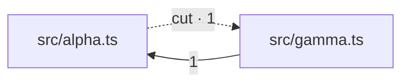

# thicket report

thicket 0.1.0 · config 97d8d00b · 4 files / 56 LOC · granularity: file (4 modules)

## Summary

| metric | value |
| --- | --- |
| analyzed | 4 of 4 source files (100.0%) |
| duplicated mass | 253 redundant nodes (overlapping; trend only) |
| duplicated coverage | 37.9% of source bytes |
| propagation cost | 0.44 |
| dependency cycles | 1 (largest SCC: 2 modules) |
| findings | 3 of 3 shown |

## Duplication

### THK-DUP-d165768d · 3 copies × ~10 lines · ~16 lines recoverable

L1 · `FunctionDeclaration` · score 26

```ts
export function normalizeAlpha(points: Point[]): Point[] {
  const result: Point[] = [];
  for (const p of points) {
…
```

- `src/alpha.ts:4`
- `src/beta.ts:3,14`

### THK-DUP-c389b5be · 2 copies × ~10 lines · ~7 lines recoverable

L0 · `Block` · score 18

```ts
{
  const result: Point[] = [];
  for (const p of points) {
…
```

- `src/alpha.ts:4`
- `src/beta.ts:14`

## Module tangle

Arrows run importer → imported. The number is distinct symbols bound across the edge; `type` marks one that is erased at compile time and so is not a runtime dependency at all. The dotted arrow is the suggested cut.

### THK-CYC-aca08f5a · SCC of 2 modules



- **suggested cut:** `src/alpha.ts` → `src/gamma.ts` — 1 symbol in `src/alpha.ts`
- **leaves:** nothing — this breaks the cycle completely.

